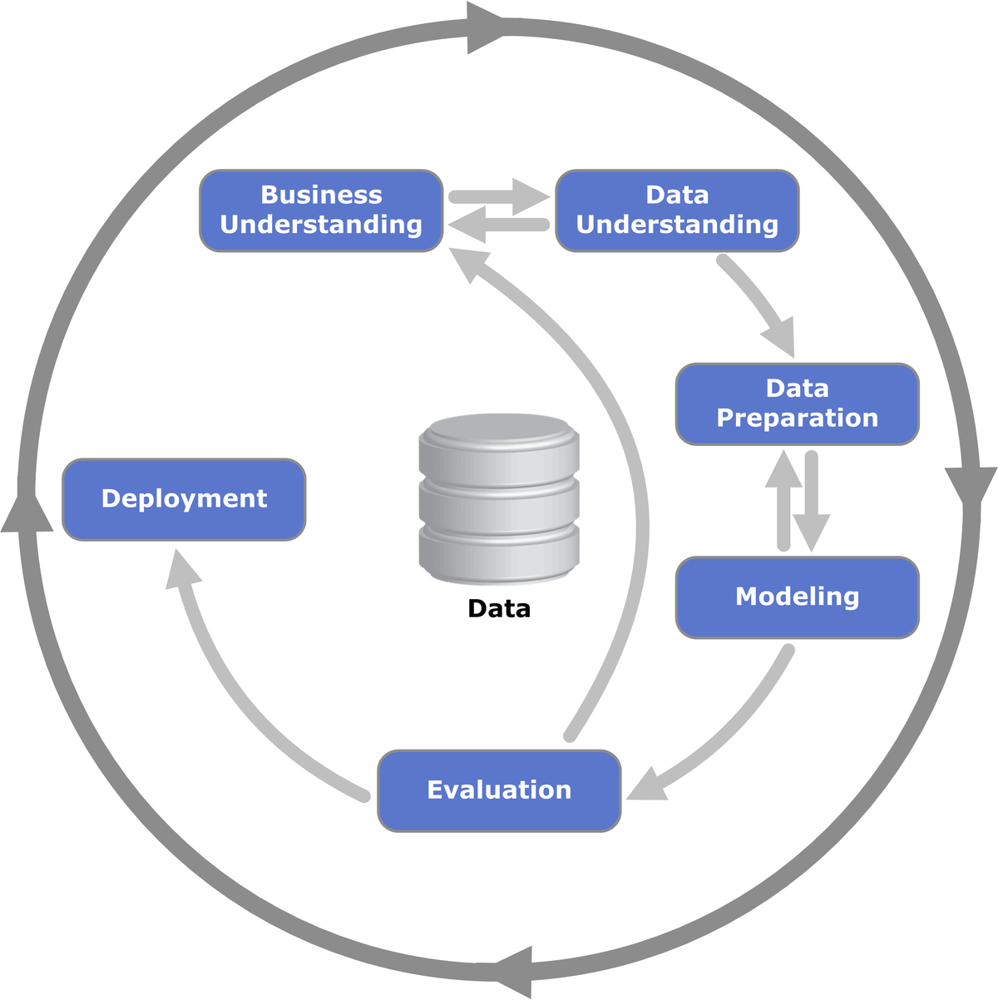

%md
## Project Description

In this project, I will be exploring the world of credit risk modeling in banks. To simulate this, I will be using a dataset provided by Lending Club, a peer-to-peer lending company. Though slightly different from the business of traditional banks loan consumers, this project would be a good stepping stone for me to learn the fundamentals of credit risk modeling. 

Specifically, i will be building 3 ML models to predict PD (Probability of Default), EAD (Exposure at Default) via tree / regression models and LGD (Loss Given Default) via survival analysis. I will then be deriving an interpretable credit scorecard and Expected Loss for each loan, to assist Lending Club in improving its credit policy. 

This project is inspired by https://github.com/allmeidaapedro/Lending-Club-Credit-Scoring, and I will be incorporating additional ideas in different phases of the project, such as survival analysis and PCA, for learning purposes. 

I will be utilising the Crisp-DM Data Science Framework seen below to maintain data integrity, especially given the strict regulations of Basel III.

 
