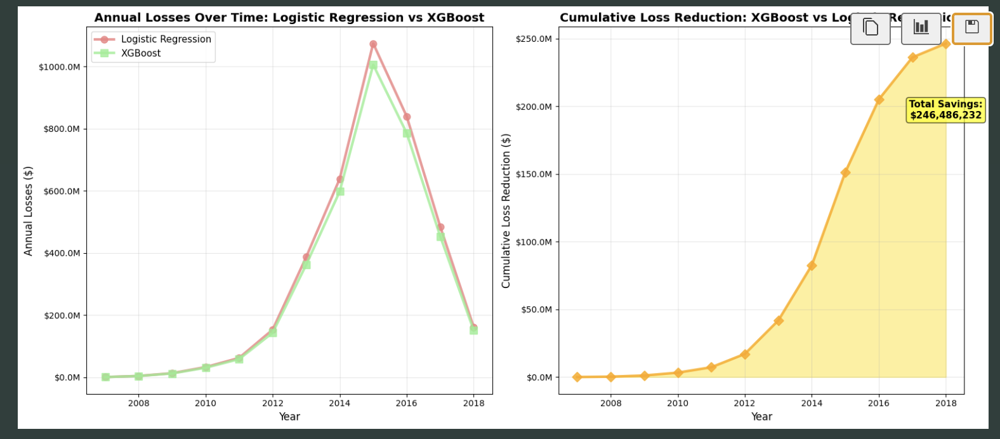

## 1. Project Description

 

In this project, I will be exploring the world of credit risk modeling in banks. To simulate this, I will be using a dataset provided by Lending Club, a peer-to-peer lending company. Though slightly different from the business of traditional banks loan consumers, this project would be a good stepping stone for me to learn the fundamentals of credit risk modeling.

Specifically, i will be building ML models to predict PD (Probability of Default) via regression and tree machine learning models, since they are widely used in the credit risk domain, to improve credit policies of banks etc.

I will be incorporating the following ideas in the data workflow for this project, such as implementing a Medallion Architecture (to simulate data engineering workflows), utilising Pyspark for big data processing, building both baseline and challenger models, and also MLOps operations, such as logging experiment run.

I will be utilising the Crisp-DM Data Science Framework seen below to maintain data integrity, especially given the strict financial regulations of Basel III.

## 2. Business Understanding & Problem

##### 2.1 Business Understanding

- **Lending Club:** Peer-Peer lending platform / Digital Bank, allowing borrowers to seek personal loans from lenders, without the need for traditional banks.

- **Lending Club Revenue Source**: Upon borrower receiving loan, Lending Club charges a loan processing fee / commission fee (Major source of income: Before 2021)

- **Lending Club Credit Risk Workflow**:

  1. Borrowers apply loan on Lending Club marketplace, providing personal financial information
  2. Lending Club use **credit risk modeling** to assign a risk grade, connecting them to interested lenders
  3. Lending Club earn **commission fees** from connecting borrowers and lenders, while lenders earn **interest** from loans

- **Why care about Credit Risk Modeling?**
  - **Too strict?**: Lose good borrowers and opportunities to earn commission fees, leading to **revenue loss** 💸
  - **Too lenient**?: Increased number of defaults lead to loss of trust of investors in Lending Club, leading to **revenue loss** 💸

##### 2.2 Business Problem

- Lending Club wants to **reduce its financial losses** by capturing default loans more effectively. It sees the need to build **highly accurate credit risk models**, reduce its risk appetite.

- **Task:** As a junior data scientist, I will need to **help Lending Club build credit risk models, to predict the probability of default of a loan. s**

##### 2.3 Project Objectives

1. Build a **baseline Probability of Default (PD) model** that effectively identifies high-risk loans, serving as a reliable benchmark for comparison.

2. Develop a **challenger PD model** to improve upon the baseline’s predictive performance, enabling continuous enhancement in risky loan detection

3. Apply **comprehensive model evaluation** techniques that meet the stringent requirements of Basel III financial regulations

## 3. Technical Workflow & Architecture

- Medallion architecture with PySpark for scalable data engineering and processing.
- Data preprocessing, feature engineering with Pandas in Jupyter notebooks.
- ML modeling with Scikit-learn, XGBoost, experiments logged in Weights & Biases (similar ML logging interface to MlFlow)

## 4. Project Directory Guideline

- **data/**: Output by Pyspark Medallion Architecture
- **images/**: Contains images needed for storytelling and visualisations
- **notebooks/**: Contains Jupyter notebooks for data preprocessing, model building and model evaluation
- **sandbox/**: For data exploration tasks (e.g. identify issues with data for subsequent data preocessing)

## 5. Tools & Technologies

- **Azure Databricks**: Aborted operation since I ran out of student credits mid-project (But experienced Databricks Key Features such as Spark Clusters, Catalog, Orchestration of Compute Workflows, SparkML etc)
- **PySpark** Big Data Processing & Engineering / Medallion Architecture
- **Pandas / Numpy**: Data Sampling, Data Preprocessing, Feature Engineering
- **Seaborn / Matplotlib**: Data Visualisation
- **Scikit-learn**: Machine Learning / Model Evaluation
- **XGBoost** Gradient Boosting Ensemble Modeling
- **Random Forest**: Bagging Ensemble Model
- **Wandb (Weights & Biases)**: For logging machine learning models performance & metrics (for easy visual comparison and complying to data science workflow guidelines)

## 6. Skills Acquired

- **Knowledge of Credit Risk Domain**: Key domain terminologies & knowledge of common machine learning models (e.g. LGD, EAD Modeling, Survival Analysis, Beta / Multiple Linear Regression, Ensemble Models such as Bagging, Boosting, Bagging mechanisms)
- **Azure Databricks** (Knowledge of Databricks Workspace, Notebooks, Clusters, Delta Tables)
- **Pyspark** (Syntax & Big Data Processing / Cleaning Skills, Attachment of Clusters -> Notebooks, Integration with Databricks, Knowledge of SparkML library)
- **Pandas/Numpy**: Data Analysis, Feature Engineering
- **Sci-Kit Learn**: Machine Learning & Usage of Pipeline and custom classes (for feature engineering / data preprocessing)
- **Feature Engineering Techniques**: Domain based interaction feature creation e.g. ways of feature selection (e.g. WoE)
- **Practical Machine Learning Modeling**: Explored classification models (e.g. Logistic Regression & XGBoost & Random Forest), understanding their evaluation metrics and typical ways of tuning hyperparamters
- **Typical Data Science Workflow**: Understood the concepts of experiments & runs in Machine Learning & key platforms like Mlflow & WandB used for comparison of results between models / experiments

## 7. To Start

1. Clone the repo
2. Install packages & libraries via `pip install -r requirements.txt`
3. Run `*.ipynb` files in `notebooks/` in sequence 

## 8. Model Results

The following results are based on the default class. This is because in credit risk modeling, we care more about capturing highly possible defaulted loans. 

##### 8.1 **Logistic Regression Model**

| Metric        | Value | What It Means                                                                                 |
| ------------- | ----- | --------------------------------------------------------------------------------------------- |
| **Precision** | 0.28  | When the model predicted "positive", it was right about **28%** of the time.                  |
| **Recall**    | 0.66  | The model caught about **66%** of all actual positives.                                       |
| **F1 Score**  | 0.40  | Balance between precision & recall — good for seeing trade-off.                               |
| **Gini**      | 0.38  | Measure of model's ability to rank correctly; higher means better separation between classes. |

##### 8.2 **XGBoost Model**

| Metric        | Value | What It Means                                                                                 |
| ------------- | ----- | --------------------------------------------------------------------------------------------- |
| **Precision** | 0.320 | When the model predicted "positive", it was right about **32%** of the time.                  |
| **Recall**    | 0.740 | The model caught about **74%** of all actual positives.                                       |
| **F1 Score**  | 0.45 | Balance between precision & recall — good for seeing trade-off, (in default class)              |
| **Gini**      | 0.422 | Model separates default and non-default classes better with the tuned XGBoost model |

##### 8.3 **Random Forest Model**

| Metric        | Value | What It Means                                                                                 |
| ------------- | ----- | --------------------------------------------------------------------------------------------- |
| **Precision** | 0.351 | When the model predicted "positive", it was right about **35%** of the time.                  |
| **Recall**    | 0.566 | The model caught about **56%** of all actual positives.                                       |
| **F1 Score**  | 0.433 | Balance between precision & recall — good for seeing trade-off, (in default class)              |
| **Gini**      | 0.390 | Model separates default and non-default classes better with the tuned XGBoost model |

For further explanation of the model results, please refer to individual model notebooks. 

## 9. Business Metrics Calculation 
Among the models tested, XGBoost emerged as the best-performing model, achieving the highest recall (74%) and F1 score (0.45) for the default class, while raising a OK number of false alarms from the baseline model. This indicates that the XGBoost model was the most effective at identifying high-risk loans while maintaining a reasonable balance between precision and recall. The Gini coefficient of 0.422 further highlights its superior ability to separate default and non-default classes compared to Logistic Regression and Random Forest models.

In the notebook `06_metrics_calculations.ipynb`, we calculated the financial impact of implementing the XGBoost model for credit risk assessment. Mainly, I did the following: 
- Calculated overall default rate across the years and total loan amount 
- Compared Logistic Regression (baseline) and XGBoost (improved) models based on recall, precision, and financial metrics across the years 
- Quantified the reduction in financial losses due to improved default detection by XGBoost.

The XGBoost model managed to reduce financial losses via credit by up to 10.4% from base Logistic Regression model across the years.

## 10. Next Steps for Project Improvement
To further enhance this credit risk modeling project, we can:
  - Build more application, behavioural, collection, propensity models 
  - Monitor model performance and observe drift 
  - Containerize scripts to adhere to MLOps best practices 

By focusing on these areas, we can build a more comprehensive and effective credit risk management system, covering different real-life machine learning models used in banks.
